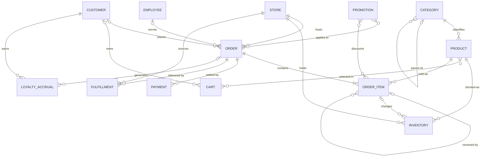

# Conceptual Data Model - Retail OLTP

**Scope:** In-store POS, Scan & Go, online, pickup/curbside, delivery.
Source system only - not the warehouse.

**Thirteen business entities.** They are not thirteen tables. Several expand
into two or more tables at the logical layer, and the expansion is listed for
each one so phase 2 knows exactly what it owes.

This is revision 2. Revision 1 had eighteen entities and is in git history at
commit d43db29. The count came down not by dropping business capability but by
modelling at the right resolution: an entity here is a thing the business names
and talks about, not every table needed to record it.

---

## Rules for this layer

Entities and relationships only. **No attributes, no keys, no data types, no
indexes, no volumes, no counts of tables.** Those belong to the logical and
physical layers.

Transaction volume does not affect this model. Volume is a physical concern -
it changes partitioning, sharding and index strategy, nothing here.

The test that decides what appears below:

**Would a store manager use this word in a sentence about their day?**

If yes, it is an entity. If it is a word *we* need in order to record what they
said - a line table, an associative resolution, a movement ledger, a lookup, an
audit trail - it is an expansion, and it belongs to phase 2. Register lanes,
per-store prices, stock movements, override records and status history are all
real and all necessary; none of them is a business object.

Applied consistently this admits thirteen entities and defers eleven
expansions. Both lists are below, because a deferred thing that is not written
down is a thing that gets lost.

This document is not done when it looks complete to us. It is done when a store
manager reads it and either agrees or corrects us.

---

## Diagram

---

## Entities

| Entity | Business meaning |
|---|---|
| CUSTOMER | A person associated with a purchase. Optional throughout - most in-store baskets are anonymous, and online allows guest checkout |
| EMPLOYEE | A person who works a transaction: operating a lane, or authorising an override. Both roles optional and independent |
| STORE | A location where stock is held or a sale is processed, physical or virtual |
| CATEGORY | A group used to organise products. Self-nesting: department, category, subcategory |
| PRODUCT | An item the retailer sells |
| INVENTORY | The stock of a product at a store |
| CART | Products selected before checkout. Not used for scanned baskets |
| ORDER | A sale or a return. The transaction itself |
| ORDER_ITEM | One item within a transaction. **The atom of the business.** A returned item may reference the original item it reverses |
| PAYMENT | One tender applied to an order |
| PROMOTION | A price reduction applying to an order, to an item, or both |
| LOYALTY_ACCRUAL | Points earned, adjusted or reversed |
| FULFILLMENT | How the customer receives the order. Not used for in-store lanes |

Nine of these are the standard retail conceptual set. Four are here because
this repo has already committed to them elsewhere and a conceptual model that
omitted them would contradict decisions already made:

| Entity | What commits us to it |
|---|---|
| ORDER_ITEM | ADR 0002 decides return linkage at **item** level. `ORDER_ITEM \|o--o{ ORDER_ITEM : reversed-by` is that decision, and it cannot be drawn without the entity. `conceptual.md` also calls it the atom of the business |
| EMPLOYEE | `docs/events.md` names "price overridden" a business event; the glossary and revision 1 both carry cashier and supervisor roles. A model with no employee cannot record who authorised a refund |
| PROMOTION | Revision 1 commits to promotions at both basket and item level, and to allocating basket offers down to items at the time of sale so partial returns refund correctly |
| LOYALTY_ACCRUAL | Revision 1 commits to loyalty as discrete accrual events rather than a balance on CUSTOMER |

If the business says any of those four is out of scope, it leaves - and the
document that changes with it is `README.md`, not this one alone.

---

## Expansion to the logical layer

The point of the granularity above. Each conceptual entity becomes one or more
tables in `model/schema.dbml`; nothing in this column is optional, and nothing
in it belongs on the diagram.

| Entity | Becomes, at the logical layer |
|---|---|
| CUSTOMER | `customer`, `customer_address` - one customer has many addresses |
| EMPLOYEE | `employee`, plus `order_approval` for override records: one basket stacks several overrides, each with its own authoriser, moment and reason |
| STORE | `store`, plus `register` - a lane is part of a store, and an order is rung on one. Possibly `register_session` too: see open question 5 |
| CATEGORY | `category`, self-referencing |
| PRODUCT | `product`, `product_identifier` for the several barcodes a product carries, and `store_product` for per-store assortment and price - price varies by store and by state |
| INVENTORY | `inventory` for position by store and product, `inventory_movement` for the immutable event ledger behind it, and `inventory_reservation` for stock held during checkout |
| CART | `cart`, `cart_item` |
| ORDER | `orders`, `order_status_history` |
| ORDER_ITEM | `order_item`, plus `order_item_tax` - a line is taxed by state, county, city and sometimes a transit district at once |
| PAYMENT | `payment` |
| PROMOTION | `promotion`, plus `promotion_application` carrying the amount allocated to each line |
| LOYALTY_ACCRUAL | `loyalty_accrual` |
| FULFILLMENT | `fulfillment`, plus `fulfillment_item` - one order is handed over in several trips, and one trip carries some of its items |

Thirteen entities, roughly twenty-two tables. Phase 2 owns every key,
attribute and resolution in the right-hand column; phase 1 owns none of it.

---

## Channel scope

Not every entity applies to every channel. Marking this prevents the model
drifting toward e-commerce.

| Entity | In-store | Scan & Go | Online / Pickup / Delivery |
|---|:-:|:-:|:-:|
| ORDER, ORDER_ITEM, PAYMENT | yes | yes | yes |
| INVENTORY | yes | yes | yes |
| PROMOTION | yes | yes | yes |
| LOYALTY_ACCRUAL | when identified | when identified | when identified |
| EMPLOYEE | staffed lanes, and any override | overrides only | rare, but yes |
| CART | no | no - the basket is an open ORDER | yes |
| FULFILLMENT | no | no | yes |

An in-store sale is created and completed in one atomic act. It has no cart, no
status lifecycle, and no fulfilment. A physical trolley holds no server-side
state at all.

**Guest checkout is permitted** on online, pickup and delivery. A cart and an
order can both exist without a registered customer, so CUSTOMER is optional on
every relationship it participates in, on every channel.

LOYALTY_ACCRUAL exists on every channel but only when a customer is identified.
An anonymous transaction generates none at the time of sale, though points may
be claimed later against a receipt.

---

## Modelling decisions

**One universal ORDER, not separate POS and online models.** The same
transaction shape serves every channel; the channel is an attribute of the
order, not a reason for a second model. This is the single most consequential
decision in the document, and everything below depends on it.

**A return is an ORDER, not a separate entity.** It carries an order type.
Financial records are immutable - we never mutate the original sale.

**Return linkage is at item level, not header level.** Each returned item
optionally references the original item it reverses. The many-to-many between a
return order and its original orders emerges from this: a customer returns items
from two receipts in one trip, and one original order is returned against
repeatedly through partial returns. See `docs/decisions/0002-link-returns-at-item-level.md`.

**The reference is optional.** No-receipt returns exist and are a major fraud
vector. Modelling returns as always having an original is wrong.

**The CART / ORDER boundary is the first scan.** The glossary defines a
transaction as one ORDER *"from first item scanned to settlement"*, and says a
thing leaving no financial record leaves no ORDER. A suspended basket has been
scanned and priced on a register, so it is an ORDER that has not settled. A
cart has been scanned by nothing, prices resolve at checkout, and abandonment
is the expected outcome. This puts **Scan & Go on the ORDER side** - the phone
is the scanner - which revision 1 had wrong. To move that line, change the
glossary first; this document follows.

**Not every stock change comes from a sale.** Supplier receipts, inter-store
transfers, shrink, cycle-count adjustments and salvage all change stock with no
order item behind them. ORDER_ITEM to INVENTORY is therefore optional on both
sides, and the movement ledger under INVENTORY exists to record changes no
transaction caused.

**Stock movement is an event; position is state.** A correction is another
movement, never an edit to the one it corrects. Position is the sum of
movements, and whether phase 3 keeps a materialised balance for read speed is a
denormalisation for `docs/physical-design.md` to accept, with a signer and a
consistency test.

**Stock committed to an unfulfilled order is not available to sell.** The
reservation mechanism enforces this during checkout, and releases the hold if
payment or order creation fails.

**PROMOTION applies at both order and item level.** An item-level markdown or
coupon attaches to a line; a basket-level offer attaches to the order. Both are
many-to-many - one line can carry a coupon *and* a store markdown *and* a
member discount at once.

**Basket-level promotions are allocated down to items at the time of sale.** An
operational requirement before an analytical one: if a customer returns one item
from a basket that carried a $10-off-$50 offer, the refund cannot be computed
without knowing how much of that discount attached to that item. The POS
computes and records the allocation at write time.

**Prices and taxes are captured as sold, never recomputed.** An order item
holds what was actually paid, and its tax holds what was actually charged, so a
refund reverses the real amounts however much the shelf price has moved since.

**Weighed items sell in fractional quantities.** Produce, meat and deli sell by
weight, so quantity is not always a whole number. The business fact belongs
here; precision, rounding and unit-of-measure handling are logical concerns.

**Loyalty is an accrual event, not a balance on CUSTOMER.** Points are earned,
adjusted and reversed as discrete events, and a balance is derived from them. A
stored balance loses history. The relationship to ORDER is optional, because a
service desk grants goodwill points with no transaction behind them.

**CUSTOMER is optional everywhere.** Anonymous in store, guest online. Identity
is resolved downstream where possible, not assumed here.

**Tax is levied per line, by several authorities at once**, at rates differing
by product taxability - groceries exempt, prepared food not. Header-level tax
cannot reverse a single line; one amount per line cannot be remitted by
authority. Phase 2 needs tax at line-and-authority grain.

---

## Open questions

**1. Voided and suspended transactions are ORDER instances with a lifecycle -
except a void before tender, which leaves no row.** A suspended basket that
resumes at another register must be state that outlives the first register, so
it is an unsettled ORDER; status history under ORDER records how it got there.
A reversal after tender is a return, not a void. A basket abandoned before any
tender is not yet a financial record and leaves nothing behind. This is why an
order may exist with no payment at all.

**2. A return does not always increase the stock it came from.** Condition
decides where the goods go: back to shelf, to salvage, to a claims hold, or
nowhere when the item is destroyed at the counter. A returned item therefore
generates zero, one or more stock movements, and not always positive ones.

**3. ORDER carries no header-level reference to the original order.** It is
derivable from the item links, and it is wrong in the case that matters: a
multi-receipt return has no single original, so the column would be null or
arbitrary exactly when the interesting thing happens. Deriving it is the
default; storing it would be a denormalisation needing an ADR.

**4. Open - does INVENTORY sit at store-and-product grain only?** Bin, aisle or
backroom-versus-shelf locations exist in real stores, and a model that cannot
say where in the store the stock is may be too coarse for pickup picking. Out
of scope until someone who picks orders says otherwise.

**5. Open - register open, register close and store day close have no entity.**
`docs/events.md` names all three as business events and states that a model
which cannot record one of them is incomplete. Nothing here represents a till
session or a trading day; `business date` is only an attribute of ORDER, and
the glossary already flags the end-of-day cutoff as unsettled. Either cash
reconciliation is out of scope for a sales model - a different process, like
procurement - or STORE expands to include `register_session` at phase 2. This is
the one place the entity list may be too short, and it needs a store manager.

---

## Deliberately excluded

Legitimate business processes that are **not in scope**:

Pharmacy, a separate HIPAA-walled system - supplier and purchase orders,
because procurement is a different process - auto care and vision work orders -
money centre and gift-card issuance - price change history - employee
scheduling - any store grouping above STORE, such as region, district or
banner, because those are reporting rollups and rollups are the OLAP team's.

Excluded as attributes or lookups rather than entities: order type, sales
channel, tender type, condition code, movement reason, unit of measure. A
closed list of codes with a name and nothing else is a domain, not an entity.
If one ever acquires history of its own - a tender type whose fees change over
time - it graduates, and that is a change to this document, not a quiet one to
the DDL.

Also excluded: `outbox_event`. Reliable event publication is an implementation
mechanism, not a business entity - a store manager has never heard of it. It is
a real table and a necessary one; it belongs to the physical layer, and
revision 1 excluded it from this layer for the same reason.
