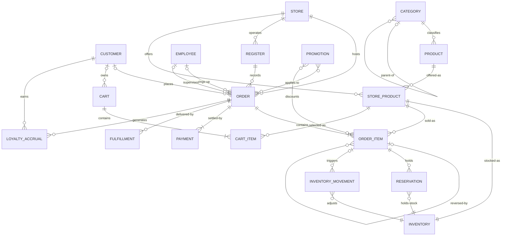

# Conceptual Data Model — Retail OLTP

**Scope:** In-store POS, online, pickup/curbside, delivery.
Source system only — not the warehouse.

---

## Rules for this layer

Entities and relationships only. **No attributes, no keys, no data types, no
indexes, no volumes.** Those belong to the logical and physical layers.

Transaction volume does not affect this model. Volume is a physical concern —
it changes partitioning and index strategy, nothing here.

This document is not done when it looks complete to us. It is done when a
store manager reads it and either agrees or corrects us.

---

## Diagram

---

## Entities

| Entity | Business meaning |
|---|---|
| CUSTOMER | A person associated with a purchase. Optional throughout — most in-store baskets are anonymous, and online allows guest checkout |
| EMPLOYEE | A person who operates a register, or who supervises and authorizes overrides. Both roles are optional and independent on any given transaction |
| STORE | A location where stock is held or a sale is processed |
| REGISTER | A physical or virtual checkout terminal within a store |
| CATEGORY | A group used to organise products. Self-nesting: department → category → subcategory |
| PRODUCT | An item the retailer sells, defined once for the whole chain |
| STORE_PRODUCT | A product as offered at a specific store — assortment and price. *Associative* |
| INVENTORY | The current stock position of a product at a store |
| INVENTORY_MOVEMENT | A single stock change: sale, return, receipt, transfer, shrink, adjustment. Only some movements originate from a sale |
| RESERVATION | Stock held for a specific item within an order — not for the whole order |
| CART | Products selected before checkout. Not used for in-store lanes |
| CART_ITEM | One product selected within a cart |
| ORDER | A sale or a return. The transaction itself. A return order may reverse items originating from one or more different original orders; that linkage is carried at item level, not header level |
| ORDER_ITEM | One item within a transaction. **The atom of the business.** A returned item may reference the original item it reverses |
| PAYMENT | One tender applied to an order |
| PROMOTION | A price reduction that may apply to an entire order, to a specific order item, or both |
| LOYALTY_ACCRUAL | Points or rewards earned, adjusted or reversed as a result of a transaction |
| FULFILLMENT | How the customer receives the order. Not used for in-store lanes |

---

## Channel scope

Not every entity applies to every channel. Marking this prevents the model
drifting toward e-commerce.

| Entity | In-store | Scan & Go | Online / Pickup / Delivery |
|---|:-:|:-:|:-:|
| ORDER, ORDER_ITEM, PAYMENT | ✓ | ✓ | ✓ |
| INVENTORY, INVENTORY_MOVEMENT | ✓ | ✓ | ✓ |
| LOYALTY_ACCRUAL | ✓ | ✓ | ✓ |
| REGISTER | ✓ | ✓ | ✗ |
| EMPLOYEE | ✓ | ✓ | ✗ |
| CART, CART_ITEM | ✗ | ✓ | ✓ |
| RESERVATION | ✗ | ✗ | ✓ |
| FULFILLMENT | ✗ | ✗ | ✓ |

An in-store sale is created and completed in one atomic act. It has no cart,
no status lifecycle, and no fulfilment. A physical shopping trolley holds no
server-side state at all.

REGISTER and EMPLOYEE are marked present on Scan & Go: the customer's device
acts as a virtual terminal, and an associate is still required to authorise
age-restricted items and exit verification. Neither entity participates in an
online order.

**Guest checkout is permitted** on online, pickup and delivery. A cart and an
order can both exist without a registered customer. CUSTOMER is therefore
optional on every relationship it participates in, across every channel.

LOYALTY_ACCRUAL exists on every channel but only when a customer is
identified. An anonymous or guest transaction generates none.

---

## Modelling decisions

**A return is an ORDER, not a separate entity.** It carries an order type.
Financial records are immutable — we never mutate the original sale.

**Return linkage is carried at item level, not header level.** Each returned
item optionally references the original item it reverses. The many-to-many
relationship between a return order and its original orders emerges from
this: a customer can return items from two receipts in one trip, and a single
original order can be returned against repeatedly through partial returns.
See [ADR 0002](decisions/0002-link-returns-at-item-level.md).

Modelling this at the header instead would need an associative entity and
would still lose the information that matters — which specific item was
returned, in what condition, and at what price it was originally sold.

**The reference is optional.** No-receipt returns exist and are a major fraud
vector. Modelling returns as always having an original is wrong.

**Not every stock movement comes from a sale.** Receipts from suppliers,
inter-store transfers, shrink, cycle-count adjustments and salvage all change
stock without any order item behind them. The relationship from ORDER_ITEM to
INVENTORY_MOVEMENT is therefore optional on both sides. This is precisely why
INVENTORY_MOVEMENT is its own entity rather than an artefact of selling.

**RESERVATION is held at item level.** A multi-item online order reserves
stock per item, from a specific store's inventory. One reservation per order
cannot express an order whose items are sourced or released independently.

**PROMOTION applies at both order and item level.** An item-level markdown or
manufacturer coupon attaches to a line. A basket-level offer ("spend $50, get
$10 off") attaches to the order. Both relationships are many-to-many — one
line can carry a coupon *and* a store markdown *and* a member discount at the
same time.

**Basket-level promotions are allocated down to individual items at the time
of sale.** This is an operational requirement before it is an analytical one:
if a customer later returns one item from a basket that carried a $10-off-$50
offer, the refund cannot be calculated without knowing how much of that
discount attached to that item. The POS must therefore compute and record the
allocation at write time.

**EMPLOYEE has two independent optional relationships to ORDER.** One is
"rings-up", for the cashier who operates a staffed lane. The other is
"supervises", for the associate who authorises an override, an age-restricted
sale, or a manual price change. Self-checkout has no cashier but still
requires a supervisor for approvals, so the two roles must be modelled
separately rather than collapsed into one.

**Weighed items sell in fractional quantities.** Produce, meat and deli are
sold by weight, so quantity is not always a whole number. The business fact
belongs here; the representation — precision, rounding rules, unit of measure
handling — is a logical-layer concern.

**Loyalty is a separate accrual entity, not an attribute of CUSTOMER.** Points
are earned, adjusted and reversed as discrete events tied to transactions, and
a running balance is derived from them. Storing a balance on CUSTOMER would
lose the history and reintroduce the same write-contention problem that
INVENTORY_MOVEMENT exists to avoid. Guest and anonymous transactions generate
no accrual at the time of sale, but loyalty may be claimed afterwards against
a receipt.

**CUSTOMER is optional everywhere.** Anonymous in store, guest checkout
online. Identity is resolved downstream where possible, not assumed here.

**INVENTORY_MOVEMENT and INVENTORY are separate.** Movement is an event,
immutable and append-only. Inventory is state, current and derived. Conflating
them loses history and creates write contention on popular items.

**Price belongs to STORE_PRODUCT, not PRODUCT.** Prices vary by store and by
state — the same reason stock does.

---

## Open questions

These are still undecided. Bring a position rather than a question.

1. **STORE_PRODUCT and INVENTORY** share a grain. One entity or two? Argument
   for two: different volatility and different owners (merchandising vs
   operations).
2. **Voided and suspended transactions** — are they ORDER instances with a
   status, or something else? A suspended basket can resume at a different
   register.
3. **Does a return always increase the inventory it came from?** Condition
   code drives whether stock returns to shelf or goes to salvage, which means
   a return does not always generate a positive inventory movement.
4. **Should ORDER also carry a header-level reference to an original order?**
   It is derivable from the item-level links, but most POS systems store it as
   a convenience for the common single-receipt case. Derive or duplicate?

---

## Deliberately excluded

Legitimate business processes that are **not in scope**:

Pharmacy (separate system, HIPAA-walled) · Supplier and purchase orders
(procurement is a different process) · Auto care and vision work orders ·
Money centre · Price change history · Employee scheduling

Also excluded: `outbox_event`. Reliable event publication is an
implementation mechanism, not a business entity. It belongs to the physical
layer.
