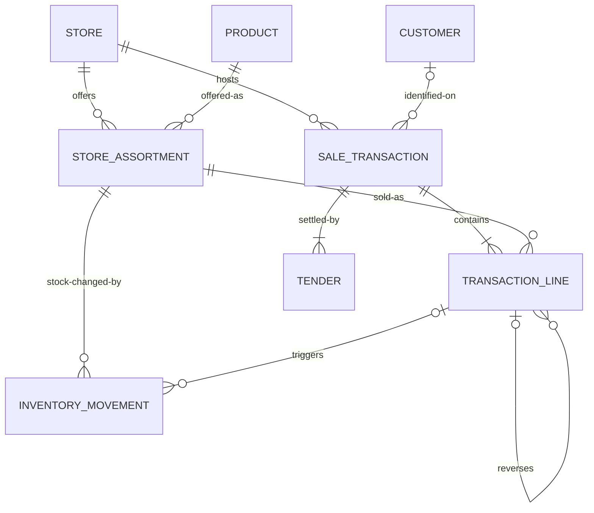

# Conceptual Data Model - Retail OLTP

**Phase 1 scope:** in-store checkout, staffed lanes and self-checkout. Selling,
returning, tendering and the stock consequences of both.

**Deferred, not excluded:** online, pickup, curbside and delivery. `README.md`
states the scope of the eventual system; this document states what phase 1
agrees to model, and assumption A1 below is what stands between the two.

Source system only - not the warehouse.

**Eight entities, and eight logical tables.** No many-to-many survives at this
layer, so nothing here resolves into an associative entity later. What the
logical phase adds is attributes and keys, not structure.

---

## Rules for this layer

Entities and relationships only. **No attributes, no keys, no data types, no
indexes, no volumes.** Those belong to the logical and physical layers.

Every relationship on the diagram carries a stated business reason. At eight
entities that standard is affordable, so it is enforced: a relationship nobody
can justify in a sentence comes off the diagram.

Four entities that a fuller model would carry - a cart, a reservation, a
register, a promotion - are absent by **assumption**, not by oversight. Each
assumption below states the condition that invalidates it. When one is
invalidated, phase 1 reopens and the entity returns; that is a normal event,
not a failure. `CONTRIBUTING.md` says going back is expected.

This document is not done when it looks complete to us. It is done when a store
manager reads it and either agrees or corrects us.

---

## Diagram

---

## Entities

| Entity | Business meaning |
|---|---|
| STORE | A location where stock is held and a sale is processed |
| PRODUCT | An item the retailer sells, defined once for the whole chain |
| STORE_ASSORTMENT | A product as offered at one store - carried here, at this price. *Associative, and the business's own noun for it* |
| CUSTOMER | A person identified on a purchase. Optional throughout - most in-store baskets are anonymous |
| SALE_TRANSACTION | A completed checkout: a sale or a return. The transaction itself, and the only financial header in the model |
| TRANSACTION_LINE | One item within a transaction. **The atom of the business.** A returned line may reference the original line it reverses |
| TENDER | One means of settlement applied to a transaction. Negative on a refund |
| INVENTORY_MOVEMENT | A single stock change at one store: sale, return, receipt, transfer, shrink, adjustment, salvage. Only some movements originate from a sale |

**On the naming.** `ORDER` and `ORDER_ITEM` are gone for two reasons. `ORDER` is
reserved in ANSI SQL, and `model/schema.dbml` already forbids reserved words as
identifiers, "not even quoted" - the old name survived only by pluralising the
table to `orders`, which is a workaround, not a name. It is also the wrong noun:
an order is *placed* and later fulfilled, whereas a checkout *completes* on
tender. Keeping `ORDER` free means it stays available if online ordering enters
scope under A1, where it will be the correct word for a genuinely different
thing.

---

## Relationships

| Relationship | Cardinality | Why the business needs it |
|---|---|---|
| STORE offers STORE_ASSORTMENT | one to many | A store carries some of the chain's products, not all of them |
| PRODUCT offered-as STORE_ASSORTMENT | one to many | The same product is carried at many stores, at prices that differ by store and by state |
| STORE hosts SALE_TRANSACTION | one to many | Every checkout happens somewhere, and store is the unit of attribution under A2 |
| CUSTOMER identified-on SALE_TRANSACTION | zero-or-one to many | Anonymous baskets are the norm in store, so the transaction cannot require a customer |
| SALE_TRANSACTION contains TRANSACTION_LINE | one to one-or-many | A transaction with no lines is not a transaction |
| SALE_TRANSACTION settled-by TENDER | one to one-or-many | A completed checkout is settled, by definition - this entity records completed checkouts only. At least one, because nothing else in scope can settle a basket: non-tender adjustments are out under A3. More than one, because split tender is routine - gift card plus debit |
| STORE_ASSORTMENT sold-as TRANSACTION_LINE | one to many | A line sells what that store carries, at that store's price - not an abstract chain product. Constrained by invariant I3: the assortment must belong to the same store as the transaction |
| STORE_ASSORTMENT stock-changed-by INVENTORY_MOVEMENT | one to many | Stock is held per store and per product, which is the assortment grain |
| TRANSACTION_LINE reverses TRANSACTION_LINE | zero-or-one to many | A returned line optionally references the original it reverses. Optional because no-receipt returns exist; many because one original is returned against repeatedly. See ADR 0002 |
| TRANSACTION_LINE triggers INVENTORY_MOVEMENT | zero-or-one to many | Most movements have no line behind them, and one returned line can produce several movements or none. The zero side exists for returns only: invariant I1 requires every *sale* line to move stock |

---

## Invariants

Rules that hold over every instance of the model. They are here rather than in
the diagram because **cardinality cannot express any of them**: two are
conditional on transaction type, one spans rows, and one relates two entities
that share no direct relationship. Each names how phase 3 is expected to enforce
it, because a rule with no enforcement route is a wish.

**I1. Every sale line moves stock, downward.** A TRANSACTION_LINE on a sale
triggers at least one INVENTORY_MOVEMENT, and the net of those movements against
the sold assortment is negative. Selling a thing and not reducing what the store
has is not a state the business can be in.

The line-to-movement relationship stays optional-to-many on the diagram because
the rule is **conditional on transaction type**, and cardinality cannot say
"one-or-many when this is a sale, zero-or-many when it is a return". Return
lines legitimately produce no movement at all - see the condition rule under
Modelling decisions. *Enforcement:* not a foreign key. Phase 3 enforces it
inside the write transaction that records the checkout, with a data quality test
proving no sale line exists without a negative net movement behind it.

**I2. A return cannot exceed what was sold and not yet returned.** For a return
line referencing an original line, the returned quantity is less than or equal
to the original quantity minus the sum of every quantity previously returned
against that same original line. Partial returns accumulate; they do not reset,
and once a line is fully returned a further return against it is refused rather
than netted.

One thing this rule deliberately does not say: it does not constrain a return
line with **no** reference. No-receipt returns carry none by decision, so nothing
in the model can bound them. That is a known fraud vector rather than an
oversight, and it is the cost of the optional reference that ADR 0002 accepted
with open eyes.

*Enforcement:* this is a cross-row aggregate over an append-only table, so no
CHECK constraint can express it. Phase 3 has two routes and the choice deserves
an ADR: a trigger that sums prior returns against the referenced line while
holding a lock on it, or a maintained returned-quantity on the original line
with a CHECK - which is an accepted denormalisation and carries everything
`docs/physical-design.md` demands of one, including a test proving the copies
agree. The trigger is the honest default; the denormalisation is worth choosing
only if a measurement justifies it.

**I3. A line's assortment belongs to the transaction's store.** The STORE on
SALE_TRANSACTION and the STORE behind each line's STORE_ASSORTMENT are the same
store. A basket rung at one store cannot contain another store's assortment, at
another store's price.

*Enforcement:* declaratively, and phase 2 should shape the keys so that it is.
Carrying the store on the line lets one composite foreign key point at the
assortment and another at the transaction, so the database refuses a mismatch
rather than trusting application code to check it.

**I4. A completed transaction is settled.** At least one TENDER, per the
cardinality above. Under A3 nothing else in scope can settle a basket.

*Enforcement:* declarative, once phase 2 settles how a one-or-many is enforced -
a deferred constraint inside the write transaction, since the header is written
before its tenders exist.

**I4 is coupled to open question 1.** It holds because SALE_TRANSACTION records
*completed* checkouts. If that question resolves toward suspended baskets being
transactions with a status, an unsettled row becomes legal and I4 weakens to
"every *completed* transaction is settled" - a conditional rule of the same
shape as I1, no longer enforceable by cardinality alone. Worth settling before
phase 2 builds against the strong form.

One edge for phase 2 to confirm rather than assume: an even exchange, where a
returned line and a sold line offset exactly. Real registers still record a
tender for it, often two that net to zero. If the business says otherwise, I4 is
the invariant that bends.

---

## Assumptions

Each one narrows the model. Each states what invalidates it. An assumption
without an invalidation condition is an omission pretending to be a decision.

**A1. Checkout is atomic. There is no state before tender and no handover
after it.** So no cart, no cart line, no reservation, no fulfilment. In store
the basket exists on a lane and in the shopper's hands, and a physical trolley
holds no server-side state.

*Invalidated when* the model must record a basket that exists before settlement
- an online cart, a suspended transaction that resumes on another lane, a
Scan & Go basket built on a phone - or a handover separated in time or place
from settlement, which is pickup, curbside and delivery. Any one of those
returns CART and FULFILLMENT, and stock held for an unsettled basket returns
RESERVATION with them.

**A2. Attribution is store-level.** So no register and no employee. A
transaction records where it happened, not which lane rang it or who served it.

This conflicted with `docs/events.md`, which lists *register opened*, *register
closed*, *store day closed* and *price overridden*, and states that a model
unable to record a listed event is incomplete. **Resolved by deferral, not by
adding entities.** Those four events are recorded in `events.md` as out of phase
1, each naming the assumption that defers it and the condition that brings it
back. Till reconciliation and override auditing are real processes, and this is
not a claim that they do not matter - only that phase 1 does not model them, and
that both documents now say so instead of one contradicting the other.

*Invalidated when* an event has to name a lane or a person: a till counted per
register, an override attributed to the associate who authorised it, or a
Scan & Go basket attributed to a device. Any of those returns REGISTER, and
override attribution returns EMPLOYEE with it.

**A3. Goods sell at their assortment price.** So no promotion, no category, no
loyalty accrual. The price on the line is the price the store carries.

*Invalidated when* a line settles at anything other than the assortment price:
a markdown, a manufacturer coupon, a basket-level offer, an employee discount.
The first of those returns PROMOTION, and with it the requirement to allocate
basket-level offers down to individual lines at the time of sale - without which
a partial return cannot be refunded correctly. That allocation will need its own
ADR when it arrives. Loyalty returns as soon as points accrue on a purchase, and
CATEGORY returns as soon as anything - an age restriction, a department
reporting line, a taxability rule - keys off a nesting of products rather than
off the product itself.

**A4. On-hand is a query over INVENTORY_MOVEMENT, not a stored position.**
Movement is an immutable event; a correction is another movement, never an edit
to the one it corrects. The position is the signed sum.

*Invalidated when* a read path needs the position faster than a ledger scan can
answer. That is not a reason to add an entity here: it is an accepted
denormalisation, and `docs/physical-design.md` governs it - the redundancy
named, what keeps the copies consistent, how divergence is detected, a signer,
an ADR, and a data quality test proving the copies agree.

**A5. Tax is a single amount per line.** So no taxing authority and no per-line,
per-authority tax grain.

*Invalidated when* tax must be remitted by jurisdiction, or when a return must
reverse the exact amounts each authority charged. A line is really taxed by
state, county, city and sometimes a transit district at once, at rates differing
by taxability - groceries exempt, prepared food not - so this assumption is the
most likely of the five to fail. It is stated rather than modelled because
remittance is not yet in phase 1 scope.

---

## Modelling decisions

**A return is a SALE_TRANSACTION, not a separate entity.** It carries a
transaction type. Financial records are immutable - we never mutate the original
sale.

**Return linkage is at line level, not header level, and the reference is
optional.** Each returned line optionally references the original line it
reverses, as a self-reference inside TRANSACTION_LINE. No associative entity is
needed. The many-to-many between a return and its original transactions emerges
from the line links: a customer returns items from two receipts in one trip, and
one original transaction is returned against repeatedly through partial returns.
No-receipt returns are common and are a significant fraud vector, so the
reference cannot be mandatory. See
`docs/decisions/0002-link-returns-at-item-level.md`.

**Not every stock movement comes from a sale.** Supplier receipts, inter-store
transfers, shrink, cycle-count adjustments and salvage all change stock with no
line behind them. The relationship is optional on both sides, which is why
INVENTORY_MOVEMENT is an entity in its own right rather than an artefact of
selling.

**A return does not always increase the stock it came from.** Condition decides
where the goods go: back to shelf, to salvage, to a claims hold, or nowhere when
the item is destroyed at the counter. One returned line therefore produces zero,
one or more movements, and not always positive ones.

**Prices are captured as sold, never recomputed.** A line holds what was
actually paid, so a refund reverses the real amount however far the shelf price
has moved since.

**Weighed items sell in fractional quantities.** Produce, meat and deli sell by
weight, so quantity is not always a whole number. The business fact belongs
here; precision, rounding and unit-of-measure handling are logical concerns.

**CUSTOMER is optional, and identity is not inferred.** Anonymous is the normal
case in store. Resolving identity downstream is the OLAP team's problem, not a
reason to require a customer here.

**Price belongs to STORE_ASSORTMENT, not PRODUCT.** Prices vary by store and by
state, for the same reason stock does.

**SALE_TRANSACTION carries no header-level reference to the original
transaction.** It is derivable from the line links, and storing it is wrong in
exactly the case that matters: a multi-receipt return has no single original, so
the column would be null or arbitrary whenever the interesting thing happens.
Storing it anyway would be a denormalisation, and `docs/physical-design.md` sets
the default at none.

---

## Open questions

**1. Are voided and suspended transactions SALE_TRANSACTION instances with a
status?** A void before tender leaves no financial record and, we think, no row
- nothing has happened yet. A reversal after tender is a return, not a void. But
a suspended basket that resumes on another lane is state that outlives the first
lane, and under A1 this model has nowhere to put it; recording it as an
unsettled transaction is the alternative to invalidating A1. This is the
question most likely to move the scope.

**2. When does a store's day end?** `business date` is the trading day a
transaction is attributed to, in the store's local timezone, and the glossary
already flags the cutoff as unsettled. Under A2 there is no store-day entity to
hang it on, so it is an attribute of the transaction and the cutoff is a rule,
not a row.

---

## Deliberately excluded

Legitimate business processes that are **not in scope**:

Pharmacy, a separate HIPAA-walled system - supplier and purchase orders,
because procurement is a different process - auto care and vision work orders -
money centre and gift-card issuance - price change history - employee
scheduling - any store grouping above STORE, such as region, district or
banner, because those are reporting rollups and rollups are the OLAP team's.

Excluded as attributes or lookups rather than entities: transaction type, tender
type, condition code, movement reason, unit of measure. A closed list of codes
with a name and nothing else is a domain, not an entity. If one ever acquires
history of its own - a tender type whose fees change over time - it graduates,
and that is a change to this document, not a quiet one to the DDL.

Also excluded: `outbox_event`. Reliable event publication is an implementation
mechanism, not a business entity - a store manager has never heard of it. It is
a real table and a necessary one, and it belongs to the physical layer.
